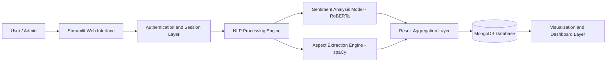
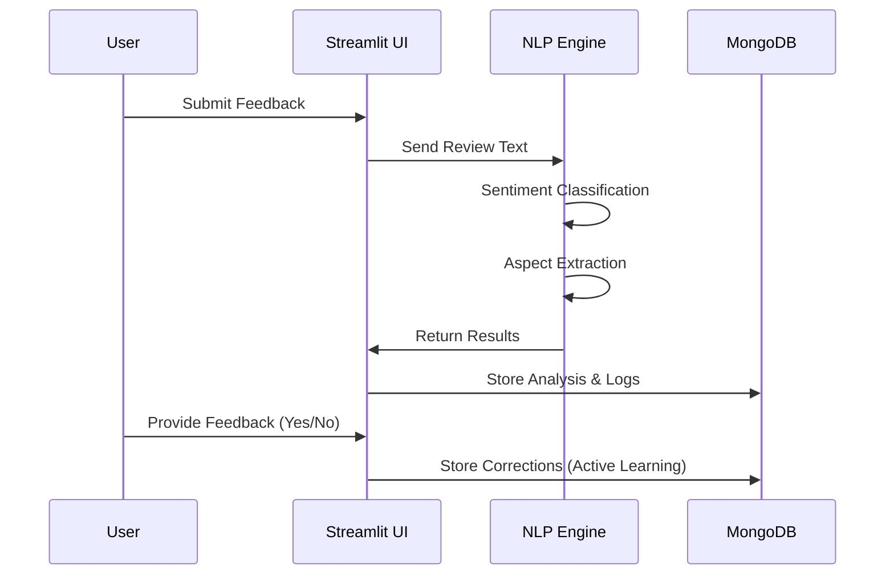
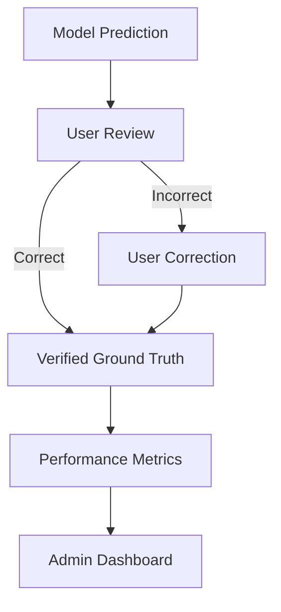

## 🧠 ReviewSense: Extracting Insights from Customer Feedback

### Overview

**ReviewSense** is a modular, AI-driven feedback analysis platform designed to extract **sentiment polarity** and **aspect-level insights** from unstructured customer feedback. The system follows a **layered architecture**, separating presentation, processing, intelligence, and persistence layers to ensure scalability, maintainability, and extensibility.

---

## 🏗️ System Architecture (Mermaid)



### Architectural Explanation

* **Presentation Layer**
  Implemented using **Streamlit**, providing an interactive web interface for users and administrators.

* **Authentication & Session Layer**
  Handles user/admin login, role-based access, and session persistence using secure password hashing.

* **NLP Processing Engine**
  Acts as the core intelligence layer, orchestrating sentiment inference and aspect extraction.

* **Persistence Layer (MongoDB)**
  Stores users, feedback, predictions, corrections, and activity logs to support analytics and active learning.

---

## 🔄 Application Workflow

### End-to-End Processing Flow



---

## 🧩 Core Processing Pipeline (Prose)

1. **Input Acquisition**
   User submits either a single review or a batch CSV containing multiple reviews.

2. **Sentiment Analysis**
   The system applies a **Transformer-based RoBERTa model** to determine overall sentiment with confidence scores.

3. **Aspect Extraction**

   * Rule-based keyword matching
   * Dependency parsing using spaCy
   * Aspect–opinion pair generation

4. **Aspect-Level Sentiment Classification**
   Each extracted aspect is assigned a sentiment using a hybrid approach:

   * Lexical sentiment overrides
   * ML-based sentiment inference
   * Negation handling

5. **Result Persistence & Visualization**
   Results are stored in MongoDB and visualized using charts for interpretability.

6. **Active Learning Loop**
   User corrections are treated as ground truth and stored for performance tracking and future model improvement.

---

## 🧠 Active Learning Architecture



### Purpose

This mechanism ensures **continuous improvement** by focusing human effort only on uncertain or incorrect predictions, thereby reducing labeling cost and improving accuracy over time.

---

## 🛠️ Technology Stack

| Layer         | Tools & Technologies               |
| ------------- | ---------------------------------- |
| UI            | Streamlit                          |
| NLP           | spaCy, Hugging Face Transformers   |
| ML            | RoBERTa (Sentiment Classification) |
| Backend       | Python                             |
| Database      | MongoDB                            |
| Security      | bcrypt                             |
| Visualization | Matplotlib                         |
| Environment   | python-dotenv                      |

---

## 🚀 Running the Project Locally

### Prerequisites

* Python **3.10 / 3.11**
* MongoDB (Local or Atlas)

### Execution Steps

```bash
git clone https://github.com/your-username/reviewsense.git
cd reviewsense
python -m venv venv
venv\Scripts\activate
pip install -r requirements.txt
python -m spacy download en_core_web_sm
streamlit run app.py
```

---

## 🌱 Open Source Contributions

This project is **open for contributions**.

We welcome:

* New aspect domains
* Model optimization
* UI/UX improvements
* Documentation enhancements
* Performance tuning

Please fork the repository, create a feature branch, and submit a pull request.

---

## 📌 Professional Note

ReviewSense is designed as a **production-inspired academic system**, following best practices in:

* Modular design
* Secure authentication
* Human-in-the-loop ML
* Explainable NLP outputs

---

